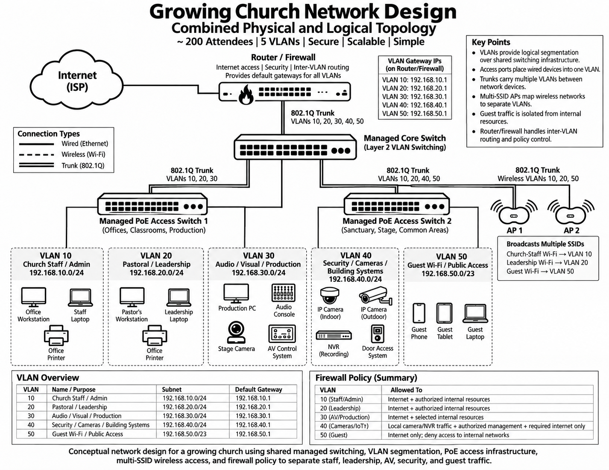
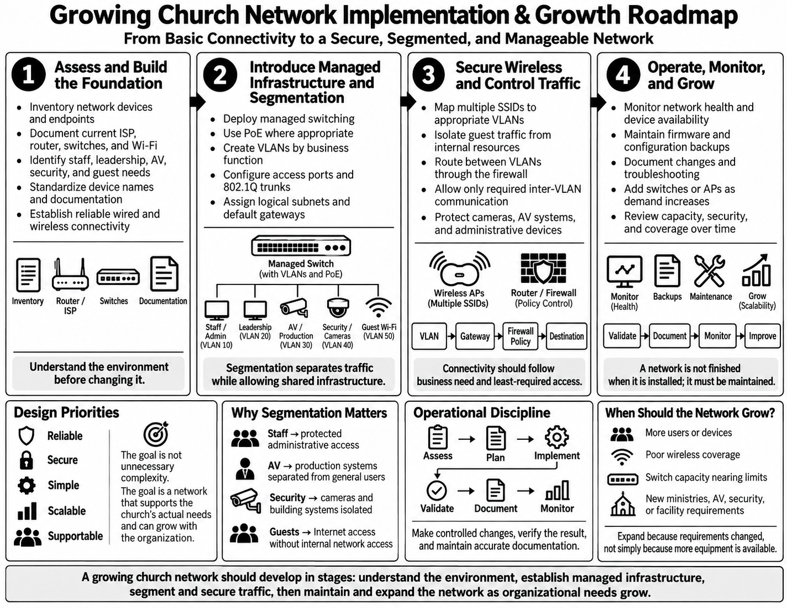

**Small-Church-Network-Design**

Conceptual church network design covering VLAN segmentation, managed switching, PoE, wireless access, firewall policy, and scalable infrastructure planning.

This project explores how I would design a structured network for a growing church environment. The design accounts for staff and administrative systems, pastoral and leadership devices, AV and production equipment, security systems, wireless access, and public guest connectivity.

The goal is to move beyond a basic flat network and create an environment that is easier to secure, troubleshoot, document, and expand. The design uses managed switching, VLAN segmentation, 802.1Q trunks, PoE infrastructure, multiple wireless SSIDs, and firewall policy to separate different types of network traffic while still using shared infrastructure.

The project also focuses on implementation and long-term operation. A network should be designed around current requirements while leaving a clear path for additional users, devices, access points, security systems, and other technology as the organization grows.

**Corporate Value**

A church network may support many different types of systems that do not need the same level of access. Staff workstations, leadership devices, AV equipment, security cameras, printers, building systems, and guest devices can all have different operational and security requirements.

Segmenting those systems provides better control over how traffic moves through the network. It also creates a cleaner environment for troubleshooting, security policy, documentation, and future expansion.

The purpose is not to add unnecessary complexity. The purpose is to create infrastructure that is reliable, secure, understandable, and able to grow with the organization.

**Objectives**

- Design a physical and logical network topology for a growing church environment.
- Use VLANs, subnets, access ports, and 802.1Q trunks to separate major network functions.
- Incorporate managed switching, PoE infrastructure, and multiple wireless SSIDs into the design.
- Define firewall and inter-VLAN routing concepts that control access between internal networks and guest traffic.
- Develop an implementation and growth model that includes validation, documentation, monitoring, maintenance, and future expansion.

**Network Topology and Segmentation**

The primary design combines the physical and logical network topology into one reference. The environment uses managed switching, VLAN segmentation, PoE access infrastructure, wireless access points, and firewall policy to separate major areas of church operations.

The design separates staff and administrative systems, pastoral and leadership systems, AV and production systems, security and building systems, and public guest traffic. Each group is assigned its own logical network while still using shared managed infrastructure.

**Growing Church Network Design**

**Implementation and Growth Roadmap**

Designing the topology is only one part of building a network. The environment also needs a structured implementation process that begins with understanding the existing infrastructure and operational requirements before changes are made.

The roadmap progresses through assessment, managed infrastructure, segmentation, wireless and firewall configuration, validation, documentation, monitoring, and future expansion. The goal is to make controlled changes and build the network in stages rather than introducing unnecessary complexity all at once.

**Growing Church Network Implementation and Growth Roadmap**

**Lessons Learned**

- Network design should begin with understanding the users, devices, traffic types, and operational requirements before selecting equipment or changing configurations.
- VLANs and subnets provide logical separation while allowing multiple groups to share the same managed switching infrastructure.
- Access ports, 802.1Q trunks, default gateways, and inter-VLAN routing each have different roles in determining how traffic moves through the network.
- Wireless SSIDs can map users into different VLANs, allowing staff, leadership, and guest wireless traffic to follow different security policies.
- Network design continues after installation through validation, monitoring, documentation, maintenance, and controlled expansion.

**Summary**

In this project, I designed a conceptual physical and logical network for a growing church environment.

The design uses managed switching, VLAN segmentation, 802.1Q trunks, PoE infrastructure, multiple wireless SSIDs, subnetting, inter-VLAN routing, and firewall policy to separate staff, leadership, AV and production, security, and guest traffic.

I also developed an implementation and growth roadmap that moves from assessment and planning through segmentation, security, validation, documentation, monitoring, and future expansion.

This project helped me connect individual networking concepts into a complete design and think more deeply about how a network can be implemented, secured, maintained, troubleshot, and expanded over time.

**Navigation**

[`Back to GitHub Profile`](https://www.github.com/cbueker-it)
